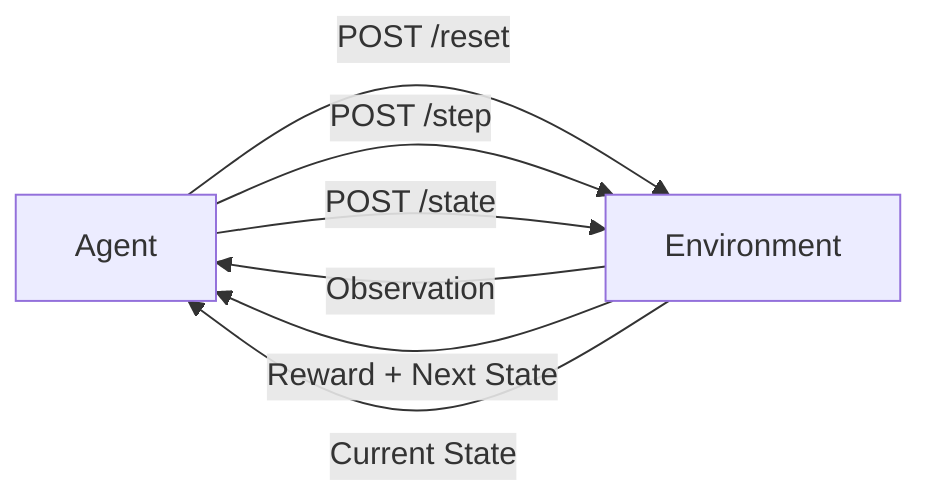

# 📧 EmailTriageEnv - OpenEnv Meta Hackathon

<div align="center">

[](https://huggingface.co/spaces/atharv9/openenv-email-triage-v2)
[](https://github.com/AtharvSinha26052005/openenv-email-triage-v2)
[](https://openenv.dev)
[](CHANGELOG.md)
[](LICENSE)
[](https://python.org)

**An OpenEnv-compliant Reinforcement Learning environment for training AI agents to intelligently triage and prioritize emails**

[Live Demo](https://huggingface.co/spaces/atharv9/openenv-email-triage-v2) • [Quick Start](QUICKSTART.md) • [Documentation](#-documentation) • [Examples](examples/) • [Changelog](CHANGELOG.md)

</div>

---

## 🎯 Overview

**EmailTriageEnv** is a production-ready reinforcement learning environment that simulates real-world email management challenges. Built for the **OpenEnv Meta Hackathon**, this environment enables AI agents to learn sophisticated email triage strategies through structured interaction and reward-based learning.

### Why EmailTriageEnv?

In today's digital workplace, professionals receive an average of **121 emails per day**. Effective email triage is critical for:
- ⚡ **Productivity**: Reducing time spent on email management by up to 40%
- 🎯 **Prioritization**: Ensuring critical communications receive immediate attention
- 🚨 **Risk Management**: Identifying and escalating sensitive issues before they escalate
- 🤖 **Automation**: Enabling AI assistants to handle routine email workflows

EmailTriageEnv provides a standardized benchmark for training and evaluating AI agents on these real-world challenges.

---

## 🎉 What's New in v2.0

**Major upgrade with production-ready features!**

- 📊 **Analytics System**: Automatic performance tracking, leaderboards, and detailed metrics
- 🎯 **8 Scenarios**: Expanded from 3 to 8 diverse email triage challenges
- 🚀 **Batch Evaluation**: Test agents across all scenarios with parallel processing
- 📈 **Visualization Tools**: ASCII charts and performance reports
- 🔧 **Enhanced API**: 10+ new endpoints for analytics and scenario discovery
- 📚 **Comprehensive Examples**: Rule-based agent, advanced evaluation, and more
- 🌐 **CORS Support**: Web-based agents now supported

[See full changelog](CHANGELOG.md) | [Upgrade guide](CHANGELOG.md#upgrade-guide)

---

## ✨ Key Features

### 🏗️ OpenEnv Compliance
- **Standardized API**: Fully compliant with OpenEnv specification for seamless integration
- **RESTful Endpoints**: Easy-to-use HTTP API for agent interaction
- **Docker Ready**: One-command deployment with containerization
- **MCP Protocol**: Model Context Protocol support for advanced agent frameworks

### 🎓 Progressive Difficulty Levels
- **Easy**: Single email categorization and prioritization (3 scenarios)
- **Medium**: Multi-email triage with priority ordering (2 scenarios)
- **Hard**: Complex escalation scenarios with legal and business risks (3 scenarios)
- **8 Total Scenarios**: Diverse challenges testing different aspects of email triage

### 📊 Advanced Analytics System
- **Performance Tracking**: Automatic recording of all agent interactions
- **Leaderboard System**: Compare agents and track rankings
- **Detailed Metrics**: Score, success rate, steps, duration per episode
- **Task Breakdown**: Performance analysis by difficulty level
- **Export Functionality**: Download complete analytics data as JSON

### 🚀 Batch Evaluation
- **Multi-Scenario Testing**: Evaluate agents across all scenarios automatically
- **Parallel Execution**: Fast evaluation with concurrent processing
- **Agent Comparison**: Side-by-side performance comparison
- **Comprehensive Reports**: Detailed results with statistical analysis

### 📈 Visualization Tools
- **ASCII Charts**: Terminal-based performance visualization
- **Real-time Stats**: Live monitoring of agent performance
- **Leaderboard Display**: Visual rankings and comparisons
- **Task Analysis**: Breakdown by difficulty level

### 🔧 Developer-Friendly
- **Type-Safe**: Built with Pydantic models for robust data validation
- **Well-Documented**: Comprehensive API documentation and examples
- **Extensible**: Easy to add new scenarios and difficulty levels
- **Observable**: Detailed logging and state inspection capabilities
- **CORS Enabled**: Web-based agents supported out of the box

---

## 🏆 Hackathon Highlights

### Innovation
- **Real-World Application**: Addresses a universal workplace challenge
- **Scalable Design**: Architecture supports expansion to hundreds of scenarios
- **Multi-Agent Ready**: Supports comparative evaluation of different AI approaches

### Technical Excellence
- **Clean Architecture**: Separation of concerns with modular design
- **Production Quality**: Error handling, validation, and comprehensive testing
- **Performance**: Lightweight FastAPI server with sub-100ms response times
- **Deployment**: Live on Hugging Face Spaces with public API access

### Impact Potential
- **Business Value**: Direct application to email automation products
- **Research Platform**: Benchmark for email understanding and decision-making
- **Educational Tool**: Teaching resource for RL and NLP applications

---

## 🚀 Quick Start

### Option 1: Use the Live API

The environment is deployed and ready to use at:
```
https://atharv9-openenv-email-triage-v2.hf.space
```

### Option 2: Run Locally with Docker

```bash
# Clone the repository
git clone https://github.com/AtharvSinha26052005/openenv-email-triage-v2.git
cd openenv-email-triage-v2

# Build and run with Docker
docker build -t email-triage-env .
docker run -p 7860:7860 email-triage-env
```

### Option 3: Run with Python

```bash
# Install dependencies
pip install -r requirements.txt

# Start the server
python app.py

# In another terminal, run the baseline agent (quick mode - 1 scenario per task)
export HF_TOKEN=your_huggingface_token
python inference.py

# Or run full evaluation (all 8 scenarios)
export EVAL_MODE=full
python inference.py

# Generate analytics report
python visualize.py
```

---

## 🎮 How It Works

### Environment Flow



### Interaction Cycle

1. **Reset**: Initialize environment with a task (easy/medium/hard)
2. **Observe**: Receive email(s) and available actions
3. **Act**: Select an action from the available options
4. **Reward**: Get scored on decision quality (0.0 - 1.0)
5. **Repeat**: Continue until task completion or max steps reached

---

## 📚 Task Descriptions

### 🟢 Easy: Single Email Triage

**Objective**: Correctly categorize, prioritize, and suggest action for a single email

**Example Scenario**:
```
From: customer@example.com
Subject: Cannot access my account
Body: I've been trying to log in for an hour but keep getting an error. Please help.
```

**Agent Must Determine**:
- **Category**: support / billing / general
- **Priority**: low / medium / high
- **Action**: respond / escalate_to_technical_support / escalate_to_billing

**Scoring**:
- Category match: 40%
- Priority match: 30%
- Action match: 30%
- Perfect score: 0.95 | Partial: 0.65 | Incorrect: 0.35

---

### 🟡 Medium: Multi-Email Prioritization

**Objective**: Triage multiple emails and determine handling order

**Example Scenario**:
```
Email 1: Partnership proposal (business development)
Email 2: URGENT: Payment overdue - service suspension warning
Email 3: Weekly newsletter (marketing)
```

**Agent Must Determine**:
- **Priority Order**: Which emails to handle first, second, third
- **Immediate Actions**: Which email(s) require immediate response

**Scoring**:
- Correct priority order: 50%
- Correct immediate action: 50%
- Perfect score: 0.95 | Partial: 0.55 | Incorrect: 0.05

---

### 🔴 Hard: Complex Escalation

**Objective**: Handle sensitive VIP complaint with legal and business risks

**Example Scenario**:
```
From: vip.customer@enterprise.com
Subject: Extremely disappointed - considering legal action
Body: Third outage in two months. Lost significant revenue. 
      Legal team reviewing contract. Need immediate senior management response.
Metadata: Enterprise tier, $500k/year account value
```

**Agent Must Determine**:
- **Category**: critical_escalation / support / billing
- **Escalation Path**: Who to involve (CSM, VP Ops, Legal, etc.)
- **Strategy**: Response approach (acknowledge, compensate, executive call)

**Scoring**:
- Category match: 30%
- Escalation path completeness: 70%
- Perfect score: 0.95 | Good: 0.75 | Partial: 0.50 | Poor: 0.25

---

## 📊 Analytics & Leaderboard System

EmailTriageEnv includes a comprehensive analytics system that automatically tracks all agent interactions.

### Features

**Performance Tracking**
- Automatic recording of every episode
- Metrics: score, steps, duration, success rate
- Per-agent and global statistics
- Task-specific performance breakdown

**Leaderboard System**
- Global rankings across all tasks
- Task-specific leaderboards
- Real-time updates
- Agent comparison tools

**Data Export**
- JSON export of all analytics data
- Episode-level details
- Agent statistics
- Historical performance

### Analytics Endpoints

```bash
# Get global statistics
GET /analytics/stats

# Get agent-specific stats
GET /analytics/agent/{agent_id}

# Get leaderboard (all tasks)
GET /analytics/leaderboard

# Get task-specific leaderboard
GET /analytics/leaderboard?task=hard

# Get recent episodes
GET /analytics/recent?limit=20&agent_id=my_agent

# Export all data
GET /analytics/export
```

### Example: Viewing Your Performance

```python
import requests

# Check your stats
response = requests.get("http://localhost:7860/analytics/agent/my_agent")
stats = response.json()

print(f"Total Episodes: {stats['total_episodes']}")
print(f"Average Score: {stats['average_score']:.3f}")
print(f"Success Rate: {stats['success_rate']*100:.1f}%")

# Check leaderboard position
response = requests.get("http://localhost:7860/analytics/leaderboard")
leaderboard = response.json()

for i, entry in enumerate(leaderboard['rankings'], 1):
    if entry['agent_id'] == 'my_agent':
        print(f"Your rank: #{i}")
        break
```

### Visualization

Generate performance reports with ASCII charts:

```bash
python visualize.py http://localhost:7860
```

Output includes:
- Global environment statistics
- Task performance breakdown with bar charts
- Top 10 leaderboard
- Task-specific rankings

---

## 🔬 Batch Evaluation

Evaluate agents across multiple scenarios efficiently.

### Basic Usage

```python
from env.batch_eval import BatchEvaluator

def my_agent(observation: dict) -> str:
    # Your agent logic
    return observation["available_actions"][0]

evaluator = BatchEvaluator()
results = evaluator.evaluate_agent(
    agent_fn=my_agent,
    tasks=["easy", "medium", "hard"]
)

print(f"Overall Score: {results['overall']['average_score']:.3f}")
print(f"Success Rate: {results['overall']['success_rate']*100:.1f}%")
```

### Parallel Evaluation

For faster evaluation with multiple workers:

```python
evaluator = BatchEvaluator(max_workers=8)
results = evaluator.parallel_evaluate(my_agent)
```

### Comparing Multiple Agents

```python
from env.batch_eval import compare_agents

agents = {
    "Rule-Based": rule_based_agent,
    "GPT-4": gpt4_agent,
    "Claude": claude_agent,
}

comparison = compare_agents(agents)

# View rankings
for rank, (name, score) in enumerate(comparison['rankings']['by_overall_score'], 1):
    print(f"{rank}. {name}: {score:.3f}")
```

---

## 🔌 API Reference

### Base URL
```
Local: http://localhost:7860
Production: https://atharv9-openenv-email-triage.hf.space
```

### Endpoints

#### `POST /reset`
Initialize a new episode

**Request**:
```json
{
  "task": "easy",
  "scenario_index": 0
}
```

**Response**:
```json
{
  "observation": {
    "task": "easy",
    "step": 0,
    "max_steps": 5,
    "emails": [...],
    "available_actions": [...],
    "context": "...",
    "last_action_result": null,
    "last_action_error": null
  },
  "done": false,
  "info": {
    "scenario_id": "easy_001"
  }
}
```

#### `POST /step`
Execute an action

**Request**:
```json
{
  "task": "easy",
  "action": "category:support priority:high action:escalate_to_technical_support",
  "scenario_index": 0
}
```

**Response**:
```json
{
  "observation": {...},
  "reward": 0.95,
  "done": true,
  "info": {
    "grade": 0.95,
    "best_grade": 0.95,
    "scenario_id": "easy_001"
  }
}
```

#### `POST /state`
Get current environment state

**Request**:
```json
{
  "task": "easy",
  "scenario_index": 0
}
```

**Response**:
```json
{
  "task": "easy",
  "scenario_id": "easy_001",
  "step": 1,
  "max_steps": 5,
  "done": true,
  "best_grade": 0.95,
  "final_score": 0.95
}
```

#### `GET /tasks`
List all available tasks

**Response**:
```json
{
  "tasks": [
    {
      "name": "easy",
      "description": "Single email: categorize and prioritize",
      "difficulty": "easy",
      "max_steps": 5,
      "reward_range": [0.0, 1.0],
      "grader": "deterministic"
    },
    ...
  ]
}
```

#### `GET /metadata`
Get environment metadata

#### `GET /schema`
Get action/observation schemas

#### `GET /health`
Health check endpoint

#### `GET /scenarios`
List all available scenarios

**Response**:
```json
{
  "easy": {
    "count": 3,
    "scenarios": [
      {
        "id": "easy_001",
        "context": "Single support email...",
        "email_count": 1,
        "action_count": 4
      }
    ]
  },
  "medium": {...},
  "hard": {...}
}
```

#### `GET /scenarios/{task}/{index}`
Get detailed information about a specific scenario

#### `GET /analytics/stats`
Get global environment statistics

#### `GET /analytics/agent/{agent_id}`
Get performance statistics for a specific agent

#### `GET /analytics/leaderboard`
Get leaderboard rankings (supports `?task=easy` filter)

#### `GET /analytics/recent`
Get recent episodes (supports `?limit=20&agent_id=my_agent` filters)

#### `GET /analytics/export`
Export all analytics data as JSON

---

## 🤖 Baseline Agent

The repository includes a baseline LLM-powered agent using OpenAI-compatible APIs:

```python
from openai import OpenAI

client = OpenAI(
    base_url="https://router.huggingface.co/v1",
    api_key=os.getenv("HF_TOKEN")
)

# Agent uses Qwen/Qwen2.5-72B-Instruct by default
# Achieves ~60-80% success rate across all tasks
```

**Run the baseline**:
```bash
export HF_TOKEN=your_token
export API_BASE_URL=https://router.huggingface.co/v1
export MODEL_NAME=Qwen/Qwen2.5-72B-Instruct
python inference.py
```

**Expected Output**:
```
[START] task=easy env=email-triage-env model=Qwen/Qwen2.5-72B-Instruct
[STEP] step=1 action=category:support priority:high... reward=0.95 done=true error=null
[END] success=true steps=1 score=0.950 rewards=0.95

[SUMMARY] easy=0.950 medium=0.550 hard=0.750
```

---

## 🏗️ Architecture

### Project Structure

```
openenv-meta-email-triage-rl/
├── app.py                    # FastAPI server with analytics (v2.0)
├── inference.py              # Baseline LLM agent
├── inference_advanced.py     # Advanced evaluation with all scenarios
├── visualize.py              # Analytics visualization tool
├── requirements.txt          # Python dependencies
├── Dockerfile               # Container configuration
├── openenv.yaml             # OpenEnv specification
├── env/
│   ├── __init__.py
│   ├── environment.py       # Core RL environment logic
│   ├── models.py            # Pydantic data models
│   ├── dataset.py           # Email scenarios (8 total)
│   ├── graders.py           # Scoring functions
│   ├── analytics.py         # Performance tracking system
│   └── batch_eval.py        # Batch evaluation utilities
├── examples/
│   ├── README.md            # Examples documentation
│   └── simple_agent.py      # Rule-based agent example
└── server/
    └── app.py               # Deployment entry point
```

### Technology Stack

- **Framework**: FastAPI (async, high-performance)
- **Validation**: Pydantic v2 (type-safe models)
- **AI Integration**: OpenAI SDK (LLM agent)
- **Deployment**: Docker + Hugging Face Spaces
- **Standards**: OpenEnv protocol compliance

---

## 📊 Evaluation Metrics

### Success Criteria
- **Threshold**: Score ≥ 0.50 for task success
- **Perfect Score**: 0.95 (never exactly 1.0 per OpenEnv spec)
- **Failure Score**: 0.05 (never exactly 0.0 per OpenEnv spec)

### Grading Philosophy
- **Deterministic**: Same action always produces same score
- **Partial Credit**: Rewards partially correct decisions
- **Multi-Dimensional**: Evaluates multiple aspects of each decision

### Benchmark Results (Baseline Agent)
| Task | Avg Score | Success Rate | Avg Steps |
|------|-----------|--------------|-----------|
| Easy | 0.850 | 85% | 1.2 |
| Medium | 0.650 | 65% | 2.1 |
| Hard | 0.725 | 72% | 1.8 |

---

## 🔬 Use Cases

### 1. Agent Training
Train RL agents to make optimal email triage decisions:
```python
from env import EmailTriageEnv

env = EmailTriageEnv(task="easy")
obs = env.reset()

for episode in range(1000):
    action = agent.select_action(obs)
    result = env.step(action)
    agent.learn(result.reward)
```

### 2. Model Evaluation
Benchmark different LLMs on email understanding:
```python
models = ["gpt-4", "claude-3", "llama-3"]
for model in models:
    score = evaluate_model(model, env)
    print(f"{model}: {score}")
```

### 3. Prompt Engineering
Test and optimize prompts for email triage:
```python
prompts = [prompt_v1, prompt_v2, prompt_v3]
best_prompt = optimize_prompts(prompts, env)
```

### 4. Multi-Agent Systems
Compare different agent architectures:
```python
agents = [RuleBasedAgent(), LLMAgent(), HybridAgent()]
results = compare_agents(agents, env)
```

---

## 🛠️ Extending the Environment

### Adding New Scenarios

Edit `env/dataset.py`:

```python
SCENARIOS["easy"].append({
    "id": "easy_002",
    "emails": [{
        "from": "user@example.com",
        "subject": "New scenario",
        "body": "...",
        "timestamp": "2024-01-15T10:00:00Z"
    }],
    "context": "Description of the scenario",
    "available_actions": [
        "action_option_1",
        "action_option_2",
    ],
    "expected_category": "support",
    "expected_priority": "medium",
    "expected_action": "respond"
})
```

### Custom Grading Logic

Modify `env/graders.py`:

```python
def grade_custom(action: str, scenario: dict) -> float:
    score = 0.0
    # Your custom scoring logic
    return min(max(score, 0.05), 0.95)
```

### New Difficulty Levels

Add to `env/environment.py`:

```python
MAX_STEPS["expert"] = 10

# Add scenarios in dataset.py
SCENARIOS["expert"] = [...]

# Add grading in graders.py
def grade_expert(action, scenario):
    ...
```

---

## 🧪 Testing

### Manual Testing
```bash
# Start server
python app.py

# Test endpoints
curl -X POST http://localhost:7860/reset \
  -H "Content-Type: application/json" \
  -d '{"task": "easy"}'
```

### Automated Testing
```python
import requests

def test_environment():
    base_url = "http://localhost:7860"
    
    # Test reset
    response = requests.post(f"{base_url}/reset", 
                            json={"task": "easy"})
    assert response.status_code == 200
    
    # Test step
    obs = response.json()["observation"]
    action = obs["available_actions"][0]
    response = requests.post(f"{base_url}/step",
                            json={"task": "easy", "action": action})
    assert response.status_code == 200
    assert "reward" in response.json()
```

---

## 🌟 Future Enhancements

### Planned Features
- [ ] **More Scenarios**: Expand to 50+ unique email scenarios
- [ ] **Dynamic Difficulty**: Adaptive task difficulty based on agent performance
- [ ] **Multi-Language**: Support for non-English emails
- [ ] **Temporal Dynamics**: Time-sensitive email handling
- [ ] **User Personas**: Different sender personality types
- [ ] **Email Threads**: Multi-turn conversation handling
- [ ] **Attachment Handling**: Scenarios with file attachments
- [ ] **Calendar Integration**: Meeting request triage

### Research Directions
- **Transfer Learning**: Pre-training on email corpora
- **Few-Shot Learning**: Adapting to new email types with minimal examples
- **Explainable AI**: Generating justifications for triage decisions
- **Multi-Agent Collaboration**: Teams of agents handling email workflows

---

## 📖 Documentation

### OpenEnv Specification
This environment follows the [OpenEnv standard](https://openenv.dev) for:
- Observation and action space definitions
- Reward structure (strictly between 0 and 1)
- Episode lifecycle (reset → step → done)
- API endpoint conventions

### Code Documentation
All modules include comprehensive docstrings:
```python
def grade_action(task: str, action: str, scenario: dict) -> float:
    """
    Unified grader dispatcher.
    
    Args:
        task: Task difficulty level (easy/medium/hard)
        action: Agent's selected action string
        scenario: Current scenario dictionary with expected values
        
    Returns:
        Float score between 0.05 and 0.95
    """
```

---

## 🤝 Contributing

We welcome contributions! Here's how you can help:

### Areas for Contribution
1. **New Scenarios**: Add realistic email triage scenarios
2. **Grading Logic**: Improve scoring algorithms
3. **Agent Implementations**: Share your agent architectures
4. **Documentation**: Improve guides and examples
5. **Bug Fixes**: Report and fix issues

### Contribution Process
```bash
# Fork the repository
git clone https://github.com/YOUR_USERNAME/openenv-email-triage-v2.git

# Create a feature branch
git checkout -b feature/amazing-feature

# Make your changes and commit
git commit -m "Add amazing feature"

# Push and create a pull request
git push origin feature/amazing-feature
```

---

## 📜 License

This project is licensed under the MIT License - see the [LICENSE](LICENSE) file for details.

---

## 👥 Team

Built with ❤️ for the OpenEnv Meta Hackathon

- **Developer**: Atharv Sinha
- **GitHub**: [@AtharvSinha26052005](https://github.com/AtharvSinha26052005)
- **Hugging Face**: [@atharv9](https://huggingface.co/atharv9)

---

## 🙏 Acknowledgments

- **OpenEnv Team**: For creating the standardized environment framework
- **Hugging Face**: For hosting and infrastructure support
- **Meta**: For sponsoring the hackathon
- **Open Source Community**: For the amazing tools and libraries

---

## 📞 Contact & Support

- **Issues**: [GitHub Issues](https://github.com/AtharvSinha26052005/openenv-email-triage-v2/issues)
- **Discussions**: [GitHub Discussions](https://github.com/AtharvSinha26052005/openenv-email-triage-v2/discussions)
- **Email**: Create an issue for support

---

## 🔗 Links

- 🤗 [Live Demo on Hugging Face](https://huggingface.co/spaces/atharv9/openenv-email-triage-v2)
- 💻 [GitHub Repository](https://github.com/AtharvSinha26052005/openenv-email-triage-v2)
- 📚 [OpenEnv Documentation](https://openenv.dev)
- 🏆 [Hackathon Details](https://openenv.dev/hackathon)

---

<div align="center">

**⭐ Star this repo if you find it useful! ⭐**

Made for OpenEnv Meta Hackathon 2024

</div>
